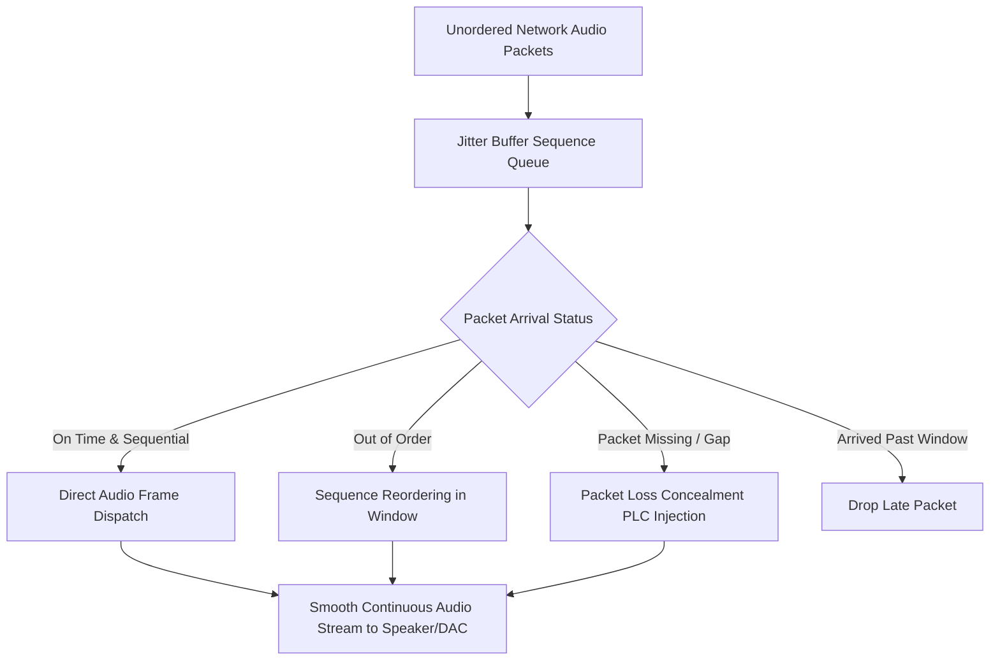

# GenPark AI Agent Skill - Real-Time Jitter Buffer Audio Packet Scheduler

Adaptive RTP and WebSocket audio packet jitter buffer optimizer smoothing network latency, reordering packets, and injecting packet loss concealment (PLC).

Verified by [GenPark AI](https://genpark.ai) and compatible with [Model Context Protocol (MCP)](https://genpark.ai/mcp).

## Architecture Diagram

## Features
- **Deterministic Packet Reordering**: Restores sequential integrity regardless of network path jitter.
- **Packet Loss Concealment (PLC)**: Injects smooth synthetic transitions to eliminate audible clicks.
- **Zero External Dependencies**: Pure Python 3.9+ standard library.
